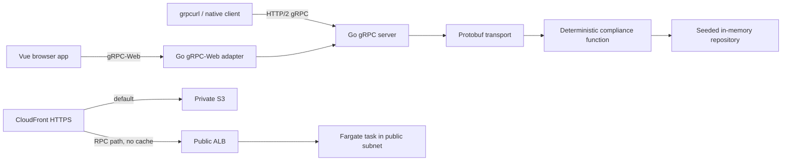

# Portfolio Compliance Demo

An intentionally small, explainable learning project for discussing Go, gRPC, Protobuf, Vue, Docker, testing, and AWS infrastructure in a technical interview. It evaluates a proposed trade against one rule: the projected value of the target instrument must not exceed 10% of portfolio NAV.

## Architecture



Locally, native gRPC listens on `9090`; gRPC-Web and `/healthz` listen on `8080`. Docker Compose serves the frontend at [http://localhost:5173](http://localhost:5173) and proxies only the Protobuf gRPC-Web path. There is no REST replacement.

## Directory structure

```text
proto/                  versioned Protobuf contract
backend/cmd/server/     process startup and graceful shutdown
backend/internal/       domain, compliance, repository, and transport
backend/generated/      committed generated Go contracts
frontend/src/           Vue application and focused tests
frontend/generated/     committed official gRPC-Web client
infra/terraform/        AWS infrastructure
scripts/                local smoke checks
```

## Data and compliance calculation

The seeded portfolio has NAV `R1,000,000.00` and exactly three displayed holdings:

| Holding | Value | Exposure |
|---|---:|---:|
| Alpha Global Equity Fund | R90,000.00 | 9.00% |
| Beta Income Fund | R75,000.00 | 7.50% |
| Gamma Property Fund | R50,000.00 | 5.00% |

The remainder is diversified assets. A buy is funded from that remainder, so NAV stays constant. Money is stored as integer cents and limits as basis points. Passing is decided without floating point:

```text
projected instrument cents × 10,000 <= portfolio NAV cents × 1,000
```

The backend formats exposures and the complete explanation. The frontend does not recalculate the rule.

Examples:

- `R9,999.00`: Alpha projects below 10%; PASS.
- `R10,000.00`: Alpha projects to exactly 10%; PASS.
- `R10,001.00`: Alpha projects to 10.0001%; FAIL.

## Protobuf and gRPC

`compliance.v1.ComplianceService` exposes unary `GetPortfolio` and `CheckTrade` RPCs. Responses include structured status and reason enums plus a human explanation. The Go handler translates between generated messages and dependency-free domain types.

Field numbers and names are stable API. Changes should be additive. Removed field numbers and names must be `reserved`, never reused. Breaking changes require a new package such as `compliance.v2`. Generated Go and TypeScript files are committed so builds do not depend on code generation.

The official gRPC-Web 2.0.2 generator produces the browser client. The Go process uses `improbable-eng/grpc-web` 0.15.0 because it directly wraps `grpc.Server`; that project is in maintenance mode. A production refresh should prefer a maintained edge proxy such as Envoy or evaluate Connect while preserving the domain service.

## Local setup

Requirements: Docker, Docker Compose, Make, and Node/npm for direct frontend work. Host Go and Terraform are optional because Make uses pinned Docker images.

```sh
make generate         # regenerate Go and TypeScript contracts
make generate-check   # prove committed output is current
make test             # Go tests/vet and Vitest
make build            # Docker images and frontend production build
make docker-up        # app at http://localhost:5173
./scripts/smoke.sh    # health plus a real binary gRPC-Web request
make docker-down
```

For frontend-only development:

```sh
cd frontend
npm ci
npm run dev
```

The Vite proxy forwards `/compliance.v1.ComplianceService/*` to `localhost:8080`. Set `VITE_GRPC_WEB_URL` only when the browser must call a different origin. Backend settings are `GRPC_ADDRESS`, `WEB_ADDRESS`, `ALLOWED_ORIGIN`, and optional `ORIGIN_VERIFY_SECRET`.

Native gRPC can be inspected after `make docker-up`:

```sh
grpcurl -plaintext localhost:9090 list
grpcurl -plaintext -d '{"portfolioId":"portfolio-demo-001"}' localhost:9090 compliance.v1.ComplianceService/GetPortfolio
```

## Tests

Go table tests cover the three monetary boundaries, invalid amounts, unknown instruments, sell underflow, and consistency between pass/fail, reason code, and explanation. A `bufconn` integration test invokes the real generated gRPC client and verifies status mappings. Vitest covers exact money parsing, seeded rendering, pass, fail, and service errors.

Run individual verification commands with:

```sh
docker run --rm -v "$PWD/backend:/app" -w /app golang:1.25.1 go test ./...
docker run --rm -v "$PWD/backend:/app" -w /app golang:1.25.1 go vet ./...
cd frontend && npm test && npm run build
make generate-check
docker compose build
make docker-up && ./scripts/smoke.sh && make docker-down
make terraform-validate
```

## AWS design

Terraform creates a private S3 frontend bucket, CloudFront with Origin Access Control, ECR, ECS/Fargate, an ALB, two public subnets in separate availability zones, security groups, least-privilege ECS roles, and CloudWatch logs. There is no NAT Gateway. Tasks receive public IPs for image pulls but accept application traffic only from the ALB security group.

S3 is the default CloudFront origin. `/compliance.v1.ComplianceService/*` routes to the ALB with caching disabled and the required gRPC-Web request headers forwarded. Browsers use the CloudFront HTTPS domain. The demo uses HTTP from CloudFront to the ALB to avoid ACM and DNS dependencies. CloudFront adds a generated `X-Origin-Verify` value and the application checks it. This deters casual ALB bypass but is not authentication; production should use a private origin, AWS WAF, and authenticated requests.

### Plan and deploy

The checked-in configuration is safe to validate without AWS credentials:

```sh
make terraform-validate
```

With authenticated AWS CLI credentials, create and review a saved plan:

```sh
cd infra/terraform
terraform init
terraform plan -out=demo.tfplan
terraform show demo.tfplan
```

**Do not run `terraform apply` until the resource list, account, region, and cost have explicit approval.** After approved infrastructure exists:

```sh
REGION=eu-west-1
REPOSITORY_URL=$(terraform output -raw ecr_repository_url)
aws ecr get-login-password --region "$REGION" | docker login --username AWS --password-stdin "${REPOSITORY_URL%/*}"
docker build -t "$REPOSITORY_URL:latest" ../../backend
docker push "$REPOSITORY_URL:latest"

cd ../../frontend && npm ci && npm run build && cd ../infra/terraform
aws s3 sync ../../frontend/dist "s3://$(terraform output -raw frontend_bucket)" --delete
aws cloudfront create-invalidation --distribution-id "$(terraform output -raw cloudfront_distribution_id)" --paths '/*'
aws logs tail "/ecs/portfolio-compliance-demo-demo" --follow --region "$REGION"
```

### GitHub deployment

Pushes to `main` run `.github/workflows/deploy-aws.yml`. The workflow can also be started manually in GitHub Actions. Configure:

- Repository secret `AWS_ROLE_ARN`: an AWS IAM role trusted by GitHub's OIDC provider and authorized to manage this demo's resources.
- Repository secret `TF_STATE_BUCKET`: a pre-created, versioned S3 bucket for Terraform state. The role needs read/write/delete access to `portfolio-compliance-demo/terraform.tfstate` and its `.tflock` file.
- Optional repository variable `AWS_REGION`; it defaults to `eu-west-1`.

The workflow ensures ECR exists, pushes the backend image tagged with the commit SHA, applies the full infrastructure, uploads the frontend, and invalidates CloudFront. GitHub does not store long-lived AWS access keys.

### Cost and cleanup

The primary recurring costs are the ALB hourly charge/capacity units, Fargate CPU and memory while the task runs, CloudFront requests/data transfer, and CloudWatch log ingestion. S3 and ECR storage are small for this demo. Public task networking deliberately avoids a NAT Gateway, which would otherwise be a major fixed cost. Exact prices vary by region and usage; consult the AWS calculators before applying.

**Cleanup is part of the exercise:** emptying is handled by the demo bucket's `force_destroy`, then run `terraform destroy` from `infra/terraform`. Confirm that ECS tasks, ALB, CloudFront distribution, ECR repository, S3 bucket, and log group are gone. Local cleanup is `make docker-down`.

## Technology comparisons

- **REST vs gRPC:** REST/JSON is easier to inspect and broadly interoperable; gRPC provides a typed contract, generated clients, status semantics, and efficient Protobuf messages. gRPC-Web is necessary because browsers cannot use native gRPC directly.
- **Protobuf vs JSON:** Protobuf is compact and schema-driven but requires generation and careful field evolution. JSON is human-readable and flexible but shifts more validation and typing into applications.
- **Vue vs Angular:** Vue keeps this one-screen demo small and explicit. Angular offers a larger batteries-included framework that is valuable for broad enterprise applications but unnecessary here.
- **Go vs Node.js:** Go provides a small deployable binary, strong concurrency primitives, and first-class gRPC support. Node.js can share TypeScript types with a web team and excels at I/O-heavy services, but integer money and runtime validation need equal care.
- **Synchronous vs background processing:** A deterministic, fast rule check fits a unary RPC. Slow portfolios, many rules, external data, retries, or audit workflows would justify queued asynchronous processing and a result-status API.

## Known limitations and production improvements

- Seeded memory data disappears on restart; production needs a transactional repository and audit history.
- There is one rule, currency, portfolio, and target UI; production needs authorization, tenant boundaries, configuration ownership, and richer identifiers.
- The origin header is not user authentication. Add identity, authorization, TLS to the origin, WAF/rate limiting, secrets management, and private networking.
- Add observability metrics/traces, deployment alarms, backups, image signing/scanning gates, and contract-breaking checks in CI.
- Exposure formatting truncates beyond six decimal places for display; the pass/fail comparison remains exact.

## Interview talking points

Be ready to explain why the compliance function is transport-free, why cross multiplication avoids floating point, how `bufconn` tests the real RPC boundary cheaply, how gRPC-Web differs from native gRPC, why generated files are committed, how Protobuf evolves safely, and which security/cost compromises are explicitly demo-only.
